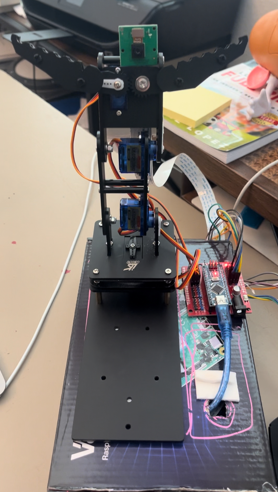

# Three Joint Robotic Arm
The Three Joint Robotic Arm is made up of four servo motors. One rotates the base, two help bend back and forth, and the last servo opens and closes the claw at the end of the arm. After building the robotic arm, I added a camera to the end of it. Throughout this project, I learned and applied Arduino code and Python. Despite encountering some bugs along the way, I was able to power through and apply the new techinques I learned to my completed project. 


| **Engineer** | **School** | **Area of Interest** | **Grade** |
|:--:|:--:|:--:|:--:|
| Kelsie S | Dublin High School | Biomechanical Engineering | Incoming Junior



  
# Final Milestone

<iframe width="560" height="315" src="https://www.youtube.com/embed/ZzZ9SbKGYis?si=5oiOW9qxkX-EhnvL" title="YouTube video player" frameborder="0" allow="accelerometer; autoplay; clipboard-write; encrypted-media; gyroscope; picture-in-picture; web-share" referrerpolicy="strict-origin-when-cross-origin" allowfullscreen></iframe>

For your final milestone, explain the outcome of your project. Key details to include are:
- What you've accomplished since your previous milestone
- What your biggest challenges and triumphs were at BSE
- A summary of key topics you learned about
- What you hope to learn in the future after everything you've learned at BSE


# Second Milestone

<iframe width="560" height="315" src="https://www.youtube.com/embed/hrOJ-Q86aEw?si=Nu_yJ5Ivngd5rjA3" title="YouTube video player" frameborder="0" allow="accelerometer; autoplay; clipboard-write; encrypted-media; gyroscope; picture-in-picture; web-share" referrerpolicy="strict-origin-when-cross-origin" allowfullscreen></iframe>

  My second milestone was to set up and make sure that my Raspberry Pi and Picamera worked. I had to set up the Pi using VNC Viewer and then connect the camera. I then used a code to take a picture on the Picamera. Once the picture was taken successfuly, I switched the power from the 9v battery connected to the arduino Arduino to a cable directly connected to the Raspberry pi. 
  During this step, my wires became loose so the arm would suddenly reset every so often. This had a simple fix of using a more secure wiring network on a breadboard. After that change, the arm moved smoothly again.
  My next steps will be to get a successful message transfer between the Arduino and the Pi in order to take a picture after moving the Joystick. I will also have to physically attach the Picamera to the Robotic Arm. 

# First Milestone

<iframe width="560" height="315" src="https://www.youtube.com/embed/0juHIlqvF68?si=pf6Dn08xyAzpEGbK" title="YouTube video player" frameborder="0" allow="accelerometer; autoplay; clipboard-write; encrypted-media; gyroscope; picture-in-picture; web-share" referrerpolicy="strict-origin-when-cross-origin" allowfullscreen></iframe>

  My first milestone was to put together the 3 joint robotic arm. I had to asseble the hardware and then add the code for the arm. The project includes servo motors, Arduino NANO, a NANO sheild, hardware components of the arm and 9V batteries as a power source. The servos will act as the joints on the arm; it will allow bending and rotation of the robotic arm and opening and closing of the claw end of the arm.
  By this point I had built the arm and added the original final code. In this milestone I also troubleshooted and worked out the problems that arose. Some of the challenges included a misalignment of the servos along the arm due to an assembly error, which I fixed by realigning the servos, and a file grouping error that prevented the joysticks from controlling the arm.
  For my next milestone, I will be adding on to this current arm. I plan to attach a camera to the end of the arm using Raspberry Pi and then link the Pi and Aruino with Bluetooth.

# Schematics 
Here's where you'll put images of your schematics. [Tinkercad](https://www.tinkercad.com/blog/official-guide-to-tinkercad-circuits) and [Fritzing](https://fritzing.org/learning/) are both great resoruces to create professional schematic diagrams, though BSE recommends Tinkercad becuase it can be done easily and for free in the browser. 

# Code

For the original arm, I followed steps on github [here]((https://github.com/Cokoino/CKK0006)) for Arduino to get the arm to run.
 
I then modified the code to produce a 'trigger' message on Arduino:

```c++
#include "src/CokoinoArm.h"
#define buzzerPin 9

CokoinoArm arm;
int xL,yL,xR,yR,zR;

const int act_max=10;    //Default 10 action,4 the Angle of servo
int act[act_max][4];    //Only can change the number of action
int num=0,num_do=0;
///////////////////////////////////////////////////////////////
void turnUD(void){
  if(xL!=512){
    if(0<=xL && xL<=100){arm.up(10);return;}
    if(900<xL && xL<=1024){arm.down(10);return;} 
    if(100<xL && xL<=200){arm.up(20);return;}
    if(800<xL && xL<=900){arm.down(20);return;}
    if(200<xL && xL<=300){arm.up(25);return;}
    if(700<xL && xL<=800){arm.down(25);return;}
    if(300<xL && xL<=400){arm.up(30);return;}
    if(600<xL && xL<=700){arm.down(30);return;}
    if(400<xL && xL<=480){arm.up(35);return;}
    if(540<xL && xL<=600){arm.down(35);return;} 
    }
}
///////////////////////////////////////////////////////////////
void turnLR(void){
  if(yL!=512){
    if(0<=yL && yL<=100){arm.right(0);return;}
    if(900<yL && yL<=1024){arm.left(0);return;}  
    if(100<yL && yL<=200){arm.right(5);return;}
    if(800<yL && yL<=900){arm.left(5);return;}
    if(200<yL && yL<=300){arm.right(10);return;}
    if(700<yL && yL<=800){arm.left(10);return;}
    if(300<yL && yL<=400){arm.right(15);return;}
    if(600<yL && yL<=700){arm.left(15);return;}
    if(400<yL && yL<=480){arm.right(20);return;}
    if(540<yL && yL<=600){arm.left(20);return;}
  }
}
///////////////////////////////////////////////////////////////
void turnCO(void){
  if(xR!=512){
    if(0<=xR && xR<=100){arm.close(0);return;}
    if(900<xR && xR<=1024){arm.open(0);return;} 
    if(100<xR && xR<=200){arm.close(5);return;}
    if(800<xR && xR<=900){arm.open(5);return;}
    if(200<xR && xR<=300){arm.close(10);return;}
    if(700<xR && xR<=800){arm.open(10);return;}
    if(300<xR && xR<=400){arm.close(15);return;}
    if(600<xR && xR<=700){arm.open(15);return;}
    if(400<xR && xR<=480){arm.close(20);return;}
    if(540<xR && xR<=600){arm.open(20);return;} 
    }
}
///////////////////////////////////////////////////////////////
void date_processing(int *x,int *y){
  if(abs(512-*x)>abs(512-*y))
    {*y = 512;}
  else
    {*x = 512;}
}
///////////////////////////////////////////////////////////////
void buzzer(int H,int L){
  while(yR<420){
    digitalWrite(buzzerPin,HIGH);
    delayMicroseconds(H);
    digitalWrite(buzzerPin,LOW);
    delayMicroseconds(L);
    yR = arm.JoyStickR.read_y();
    }
  while(yR>600){
    digitalWrite(buzzerPin,HIGH);
    delayMicroseconds(H);
    digitalWrite(buzzerPin,LOW);
    delayMicroseconds(L);
    yR = arm.JoyStickR.read_y();
    }
}
///////////////////////////////////////////////////////////////
void C_action(void){
  if(yR>800){
    int *p;
    p=arm.captureAction();
    for(char i=0;i<4;i++){
    act[num][i]=*p;
    p=p+1;     
    }
    num++;
    num_do=num;
    if(num>=act_max){
      num=0;
      buzzer(600,400);
      }
    while(yR>600){yR = arm.JoyStickR.read_y();}
    //Serial.println(act[0][0]);
  }
}
///////////////////////////////////////////////////////////////
void Do_action(void){
  if(yR<220){
    buzzer(200,300);
    for(int i=0;i<num_do;i++){
      arm.do_action(act[i],15);
      }
    num=0;
    while(yR<420){yR = arm.JoyStickR.read_y();}
    for(int i=0;i<2000;i++){
      digitalWrite(buzzerPin,HIGH);
      delayMicroseconds(200);
      digitalWrite(buzzerPin,LOW);
      delayMicroseconds(300);        
    }
  }
}
///////////////////////////////////////////////////////////////
void message_pi(void){
  if(zR!=0){
    Serial.println("Hello from Arduino!");
  }
}
void setup() {


  pinMode(3, INPUT);
  Serial.begin(9600);
  //arm of servo motor connection pins
  arm.ServoAttach(4,5,6,7);
  //arm of joy stick connection pins : xL,yL,xR,yR
  arm.JoyStickAttach(A0,A1,A2,A3);
  pinMode(buzzerPin,OUTPUT);
}
///////////////////////////////////////////////////////////////
void loop() {
  xL = arm.JoyStickL.read_x();
  yL = arm.JoyStickL.read_y();
  xR = arm.JoyStickR.read_x();
  yR = arm.JoyStickR.read_y();
  date_processing(&xL,&yL);
  date_processing(&xR,&yR);
  turnUD();
  turnLR();
  turnCO();
  C_action();
  Do_action();
  int value = 0;
  value = digitalRead(3);
  //Serial.println(value);
  if(yR < 500){
    Serial.println("Hello from Arduino!"); 
    //delay(100);
    value = 0;
  }
}
```
Then in Raspberry Pi, using python through Thonny, I used a code to recieve the 'trigger' message and then take a picture:

```
#!/usr/bin/env python3
import serial
from picamera2 import Picamera2, Preview
import time
import cv2
from datetime import datetime
import os 

folder = "armimages"

if not os.path.exists(folder):
    os.mkdir(folder)
    
def save_file (data, base_filename = "output"):

    timestamp = datetime.now().strftime("%Y%m%d-%H%M%S")
    filename = f"{base_filename}-{timestamp}.png"
    filepath = os.path.join(folder, filename)
    return filepath
if __name__ == '__main__':
    ser = serial.Serial('/dev/ttyUSB0', 9600, timeout=1)
    ser.reset_input_buffer()
    picam2 = Picamera2()
    camera_config = picam2.create_still_configuration(main={"size": (1920, 1088)}, lores={"size": (640, 480)}, display="lores")
    #camera_config = picam2.create_still_configuration({'format': 'RGB888'}, main={"size": (1920, 1080)}, lores={"size": (640, 480)}, display="lores")
    picam2.configure(camera_config)
    while True:
        if ser.in_waiting > 0:
            line = ser.readline().decode('utf-8').rstrip()
            print(line)
            if line == "trigger":
                #picam2.start_preview(Preview.QTGL) #Comment this out if not using desktop interface
                picam2.start()
                time.sleep(2)
                im = picam2.capture_array()
                filepath=save_file(im)
                cv2.imwrite(filepath, im)
```

# Bill of Materials

| **Part** | **Purpose** | **Price** | **Link** |
|:--:|:--:|:--:|:--:|
| LK COKOINO Robot Arm for Arduino | Kit to build arm | $49.99 | <a href="https://www.amazon.com/LK-COKOINO-Compliment-Engineering-Technology/dp/B081FG1JQ1"> Link </a> |
| HiLetgo 5pcs Nano I/O Expansion Sensor Shield for Arduino | Extra NANO shields | $10.99 | <a href="https://www.amazon.com/HiLetgo-Expansion-Sensor-Arduino-Duemilanove/dp/B07VQRCC8F/ref=sr_1_1_sspa?crid=IY8280UJPZ8D&dib=eyJ2IjoiMSJ9.gOnvWbSP2fpJyjlzThZoFsFPHoeaF2QpSk_jNdngKIr1twGn_LzcDoaoxYvFyCU-mVjs0xm0675XcM9jJCRLlzDOmjbGgP1sIqUhTjt4NviT5cbtoA-UvEYAIHWDWIfkb2aFMmhgHU544Wc7YJiipzzt3fuSGamCrVeh0ONFUE7GqEzOyVIpGdjm_kZqEYrk4l6Ol054nebh1I2eZg7hcYRPAX8iNqbzSBQnTX3EaUY.ewdYdtnT9O7qRCuhV_2P0vAhp7a5Ue2sdk1REW8_gKI&dib_tag=se&keywords=arduino+nano+servo+shield&qid=1716857827&s=toys-and-games&sprefix=arduino+nano+servo+shield%2Ctoys-and-games%2C85&sr=1-1-spons&sp_csd=d2lkZ2V0TmFtZT1zcF9hdGY&psc=1"> Link </a> | 
| 32 In 1 Small Screwdriver Set, Mini Magnetic Screwdriver Set | Screwdriver for assembly | $6.99 | <a href="https://www.amazon.com/Small-Screwdriver-Set-Mini-Magnetic/dp/B08RYXKJW9/"> Link </a> |
| Electronics Component Fun Kit for Arduino | Breadboard for wiring with Arduino | $13.99 | <a href="https://www.amazon.com/Smraza-Electronics-Potentiometer-tie-Points-Breadboard/dp/B0B62RL725/ref=sxts_b2b_sx_reorder_acb_business?content-id=amzn1.sym.f63a3b0b-3a29-4a8e-8430-073528fe007f%3Aamzn1.sym.f63a3b0b-3a29-4a8e-8430-073528fe007f&crid=2IC3T44H3U3WG&cv_ct_cx=breadboard+kit&dib=eyJ2IjoiMSJ9.TUd5tu2T8rmms7ZuJ0UzmbtpLL1zsu93bQM0PzwnP4E.sT0V0vL_QtbYv8ymVTCcRkhFNgBtRvRiT7G4FT1oGTE&dib_tag=se&keywords=breadboard+kit&pd_rd_i=B0B62RL725&pd_rd_r=67e1f4ff-e3b9-44e4-b441-b4ae282f036b&pd_rd_w=UjFaP&pd_rd_wg=0xRoC&pf_rd_p=f63a3b0b-3a29-4a8e-8430-073528fe007f&pf_rd_r=BFGP77H27ZN31W4PZAW6&qid=1715911733&sbo=RZvfv%2F%2FHxDF%2BO5021pAnSA%3D%3D&sprefix=breadboard+kit%2Caps%2C109&sr=1-2-9f062ed5-8905-4cb9-ad7c-6ce62808241a"> Link </a> |
| DZS Elec 6pcs 15CM 9V Battery Snap Connector Clip | Connecting 9v battery to arm | $5.99 | <a href="https://www.amazon.com/DZS-Elec-Connector-Experimental-5-5x2-1mm/dp/B07FDS11ZY/ref=sr_1_5?crid=2KDQRHR9QTG87&dib=eyJ2IjoiMSJ9.QXzrFs_APhSZ1IJhcXZvMQHwewvRuQ3vr1brQtDco3W0bnAprDG7jH7ie8dBlokDPWbOLcDtgbrHrNUzcyb61YgxbGO0UFeN6K8ktLZDkV3jlxoO940ZYOk8jrd3G8yxrkH-cUJgXaiOka1FWDDJJssGcdvyH2WlPRHUtZKQgBpoGa4M3j8wwx3yssPZrOJK32Pfs9ZLtCibGXHxhNbXOBuXOisFlpDByQ2NJcndu5iOa0dZ8jknYgybT1KOyzP9_lSVyQNCkcxcjanEjyf4Z6jMdRX-G08K6SY7IM-agSA.UzM8eWF_dtBmatnqwrbt1mCm8-reUmM7Mqm3SWpbviM&dib_tag=se&keywords=9v%2Bto%2Bbarrel%2Bjack&qid=1716857906&s=electronics&sprefix=9v%2Bto%2Bbarrel%2Bjack%2Celectronics%2C98&sr=1-5&th=1"> Link </a> |
| AstroAI Multimeter Tester 2000 Counts Digital Multimeter  | Measures voltage | $16.23 | <a href="https://www.amazon.com/AstroAI-Digital-Multimeter-Voltage-Tester/dp/B01ISAMUA6/ref=sxin_17_pa_sp_search_thematic_sspa?content-id=amzn1.sym.e8da13fc-7baf-46c3-926a-e7e8f63a520b%3Aamzn1.sym.e8da13fc-7baf-46c3-926a-e7e8f63a520b&cv_ct_cx=digital+multimeter&dib=eyJ2IjoiMSJ9.5LQumrfBR8l0mKnJCJlRg73dxpou0gqYD_ffU3srgs0Utegwth8GcQCSVXVzeZeLSJx5J3itz5TLdmJHsrVITQ.-00jRPoT-bBy26YC4LzQ-S4cYdztgmSMGb83_WEm6HY&dib_tag=se&keywords=digital+multimeter&pd_rd_i=B01ISAMUA6&pd_rd_r=e1ff2570-7e4a-4906-bc55-6f819d48d1bc&pd_rd_w=h7HgL&pd_rd_wg=0ZcFH&pf_rd_p=e8da13fc-7baf-46c3-926a-e7e8f63a520b&pf_rd_r=R6YKX3NXTDQ1PQP4H8RM&qid=1715911879&sbo=RZvfv%2F%2FHxDF%2BO5021pAnSA%3D%3D&sr=1-1-7efdef4d-9875-47e1-927f-8c2c1c47ed49-spons&sp_csd=d2lkZ2V0TmFtZT1zcF9zZWFyY2hfdGhlbWF0aWM&psc=1"> Link </a> |
| 9V Batteries | Powering the arm | ~$12 | <a href="https://www.amazon.com/Arduino-A000066-ARDUINO-UNO-R3/dp/B008GRTSV6/"> Link </a> |


